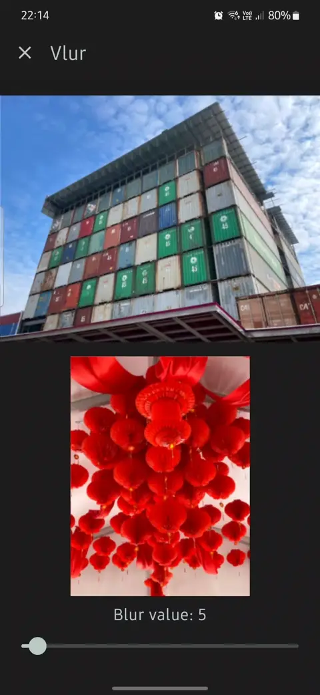

## Vlur (or Blur on Vulkan in Jetpack Compose)

Blur modifier for Jetpack Compose based on Vulkan



## Prerequisites

- Android API 28+
- HardwareAcceleration is a must
- NDK and CMake must be installed. Current versions is written in [libs.versions.toml](./gradle/libs.versions.toml)


## Import to project

Import it like any other library, check [build.gradle.kts of Sample project](./sample/build.gradle.kts)

```kotlin
    implementation("com.sadvakassov:vlur:0.2.4")
```


## Example of usage 

Check [Sample project](./sample/src/main/java/com/sadvakassov/vlur/sample/MainView.kt)

```kotlin
    // Define vulkan state that is similar to pool holder and pass it to modifier
    val vulkanState = rememberVulkanState()

    Image(
        painter = painterResource(id = R.drawable.sample_2),
        modifier = Modifier
            .align(Alignment.CenterHorizontally)
            .padding(vertical = 8.dp)
            // LOOK HERE. Apply modifier and pass vulkanState and blurIntensity value
            .vlur( 
                vulkanState = vulkanState,
                blurRadius = rescale(blurIntensity, 1.0, 25.0).toFloat(),
            ),
        contentDescription = null
    )
```


### Known issues

- It doesn't run on emulator
- I've tested in only on Samsung devices S23, A53, A54

## Links

My inspiration come from the official renderscript page
- https://github.com/android/renderscript-samples

## License

```
Copyright 2024 Akbolat Sadvakassov
 
Licensed under the Apache License, Version 2.0 (the "License");
you may not use this file except in compliance with the License.
You may obtain a copy of the License at

    https://www.apache.org/licenses/LICENSE-2.0

Unless required by applicable law or agreed to in writing, software
distributed under the License is distributed on an "AS IS" BASIS,
WITHOUT WARRANTIES OR CONDITIONS OF ANY KIND, either express or implied.
See the License for the specific language governing permissions and
limitations under the License.
```
